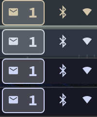

# Thunderbird Waybar Email Module

Unread email count for Waybar.



## Installation

1. Clone or download the script:
   ```bash
   git clone https://github.com/hoblin/thunderbird-waybar-email.git
   cd thunderbird-waybar-email
   ```

2. Copy the script:
   ```bash
   mkdir -p ~/.config/waybar/scripts
   cp email-count.sh ~/.config/waybar/scripts/
   chmod +x ~/.config/waybar/scripts/email-count.sh
   ```

3. Add CSS to style.css:
   ```css
   #custom-email.unread {
     background: rgba(255, 255, 255, 0.2);
     color: inherit;
     border-radius: 4px;
     padding: 0 6px;
     font-weight: bold;
     border: 1px solid currentColor;
   }

   #custom-email.read {
     opacity: 0.7;
   }
   ```

4. Add to config:
   ```json
   "custom/email": {
     "format": "{}",
     "exec": "~/.config/waybar/scripts/email-count.sh",
     "return-type": "json",
     "interval": 60,
     "tooltip": false,
     "on-click": "thunderbird"
   }
   ```

5. Add `"custom/email"` to modules list and restart waybar.

## Requirements

- Thunderbird
- Waybar
- Nerd Fonts

## Troubleshooting

- **No emails?** Open Thunderbird at least once
- **No icons?** Install Nerd Fonts

## License

MIT License

## Credits

All code in this repository was generated by the Cursor AI editor at the request of the repository owner.
